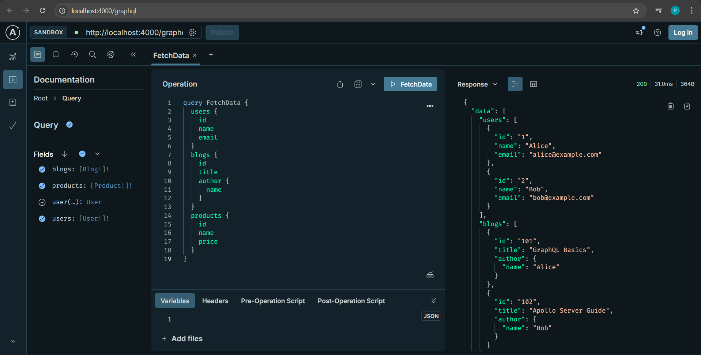
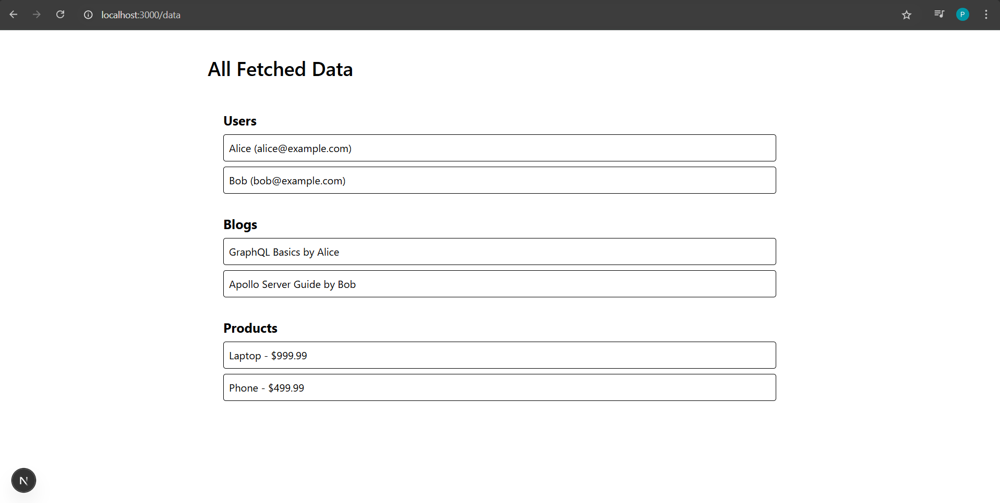

## **Setup GraphQL Server**

* [**Project Structure**](#project-structure)
* [**Step 1: Create a new project**](#step-1-create-a-new-project)
* [**Step 2: Install dependencies**](#step-2-install-dependencies)
* [**Step 3: Define your GraphQL schema**](#step-3-define-your-graphql-schema)
* [**Step 4: Create your data**](#step-4-create-your-data)
* [**Step 5: Define a resolver**](#step-5-define-a-resolver)
* [**Step 6: Create an instance of `ApolloServer`**](#step-6-create-an-instance-of-apolloserver)
* [**Step 7: Start the server**](#step-7-start-the-server)
* [**Step 8: Execute your first query**](#step-8-execute-your-first-query)

---

### **Project Structure**

```
graphql-server-example/
├── data/
│   ├── user.json
│   ├── blog.json
│   └── products.json
├── index.js
├── package.json
└── README.md

```

---

### **Step 1: Create a new project**

1. From your preferred development directory, create a directory for a new project and `cd` into it:

```bash
mkdir graphql-server-example
cd graphql-server-example
```

2. Initialize a new Node.js project with `npm` (or another package manager you
   prefer, such as Yarn):

```bash
  npm init --yes && npm pkg set type="module"
```

> This getting started guide sets up a project using ES Modules, which simplifies our examples and allows us to use top-level `await`.

Your project directory now contains a `package.json` file.

### **Step 2: Install dependencies**

Applications that run Apollo Server require two top-level dependencies:

* [`graphql`](https://npm.im/graphql) (also known as `graphql-js`) is the library that implements the core GraphQL parsing and execution algorithms.
* [`@apollo/server`](https://www.npmjs.com/package/@apollo/server) is the main library for Apollo Server itself. Apollo Server knows how to turn HTTP requests and responses into GraphQL operations and run them in an extensible context with support for plugins and other features.

Run the following command to install both of these packages and save them in
your project's `node_modules` directory:

```bash
  npm install @apollo/server graphql
```

Follow the instructions below to set up with either TypeScript or JavaScript:

#### **Set up with TypeScript**

1. Create a `src` directory with an empty `index.ts` file to contain **all** of the code for our example application:

```bash
mkdir src
touch src/index.ts
```

2. Run the following command to install the `typescript` and `@types/node` packages into your project's dev dependencies:

```bash
npm install --save-dev typescript @types/node
```

3. Next, create a `tsconfig.json` file in your project:

```bash
touch tsconfig.json
```

4. The `tsconfig.json` file enables you to configure how TypeScript will compile your code. Add the following configuration to your `tsconfig.json` file:

```json title=tsconfig.json
{
  "compilerOptions": {
    "rootDirs": ["src"],
    "outDir": "dist",
    "lib": ["es2020"],
    "target": "es2020",
    "module": "esnext",
    "moduleResolution": "node",
    "esModuleInterop": true,
    "types": ["node"]
  }
}
```

For more information on the compiler options above, see the [TypeScript Compiler docs](https://www.typescriptlang.org/tsconfig).

5. Finally, replace the default `scripts` entry in your `package.json` file with the following `type` and `scripts` entries:

```json title=package.json
{
  // ...etc.
  "type": "module",
  "scripts": {
    "compile": "tsc",
    "start": "npm run compile && node ./dist/index.js"
  }
  // other dependencies
}
```

The above `start` script tells TypeScript to compile your code into JavaScript before using `node` to run that compiled code. Setting your project's [`type` to `module`](https://nodejs.org/api/packages.html#approach-1-use-an-es-module-wrapper) loads your JavaScript files as ES modules, enabling you to use top-level [`await`](https://developer.mozilla.org/en-US/docs/Web/JavaScript/Reference/Statements/async_function) calls.

6. You can now run `npm start`, which should successfully compile and run your empty `index.ts` file, printing something like this:

```text
> graphql-server-example@1.0.0 start
> npm run compile && node ./dist/index.js
```

---

### **Step 3: Define your GraphQL schema**

The code blocks below use TypeScript. If your project uses JavaScript, you need to transpile the code.

Every GraphQL server (including Apollo Server) uses a **schema** to define the structure of data that clients can query. In this example, we'll create a server for querying a collection of users, blogs, and products.

Open `index.ts` in your preferred code editor and paste the following into it:

```ts title=index.ts
import { ApolloServer } from '@apollo/server';

// A schema is a collection of type definitions (hence "typeDefs")
// that together define the "shape" of queries that are executed against
// your data.
// Define GraphQL schema
const typeDefs = `#graphql
  type User {
    id: ID!
    name: String!
    email: String!
  }

  type Blog {
    id: ID!
    title: String!
    author: User
  }

  type Product {
    id: ID!
    name: String!
    price: Float!
  }

  type Query {
    users: [User!]!
    user(id: ID!): User
    blogs: [Blog!]!
    products: [Product!]!
  }
`;
```

> Adding `#graphql` to the beginning of a [template literal](https://developer.mozilla.org/en-US/docs/Web/JavaScript/Reference/Template_literals) provides GraphQL syntax highlighting in supporting IDEs.

This snippet defines a simple, valid A GraphQL schema defines the structure and types of data that can be queried or mutated, serving as a contract between the server and clients. GraphQL schema with three types: `User`, `Blog`, and `Product`. Each type has a set of fields, and the `Query` type defines the entry points for querying data.

### **Step 4: Create your data**

In this example, we will use JSON files to simulate a database. Create a new folder named `data` in your project directory:

```bash
mkdir data
```
Inside the `data` folder, create three JSON files: `user.json`, `blog.json`, and `products.json`. These files will contain sample data for users, blogs, and products.

Inside the `/data` folder, create three files with the following content:

### **`user.json`**

```json
[
  { "id": "1", "name": "Alice", "email": "alice@example.com" },
  { "id": "2", "name": "Bob", "email": "bob@example.com" }
]
```

### **`blog.json`**

```json
[
  { "id": "101", "title": "GraphQL Basics", "authorId": "1" },
  { "id": "102", "title": "Apollo Server Guide", "authorId": "2" }
]
```

### **`products.json`**

```json
[
  { "id": "p1", "name": "Laptop", "price": 999.99 },
  { "id": "p2", "name": "Phone", "price": 499.99 }
]
```

---

### **Step 5: Define a resolver**

We've defined our data set, but Apollo Server doesn't know that it should *use* that data set when it's executing a query. To fix this, we create a 

**resolver**: A function that populates data for a particular field in a GraphQL schema. For example:

```js title=index.ts
// Define resolvers
const resolvers = {
  Query: {
    users: () => users,
    user: (_, { id }) => users.find(user => user.id === id),
    blogs: () => blogs,
    products: () => products,
  },
  Blog: {
    author: (blog) => users.find(user => user.id === blog.authorId),
  },
};
```

**[Learn more about resolvers.](https://www.apollographql.com/docs/apollo-server/data/resolvers/)**.

Resolvers tell Apollo Server *how* to fetch the data associated with a particular type. Because our schema defines a `Query` type, we need to define a resolver for each field in the `Query` type. In this case, we need to define a resolver for the `users`, `user`, `blogs`, and `products` fields.

### **Step 6: Create an instance of `ApolloServer`**

We've defined our schema, data set, and resolver. Now we need to provide this information to Apollo Server when we initialize it.

Add the following to the bottom of your `index.ts` file:

```js
import express from 'express';
import { ApolloServer } from '@apollo/server';
import { expressMiddleware } from '@apollo/server/express4';
import cors from 'cors';
import bodyParser from 'body-parser';
import fs from 'fs';
import path from 'path';

// Load data from JSON files
const users = JSON.parse(fs.readFileSync(path.resolve('./data/user.json'), 'utf8'));
const blogs = JSON.parse(fs.readFileSync(path.resolve('./data/blog.json'), 'utf8'));
const products = JSON.parse(fs.readFileSync(path.resolve('./data/products.json'), 'utf8'));

// Define GraphQL schema
const typeDefs = `#graphql
  type User {
    id: ID!
    name: String!
    email: String!
  }

  type Blog {
    id: ID!
    title: String!
    author: User
  }

  type Product {
    id: ID!
    name: String!
    price: Float!
  }

  type Query {
    users: [User!]!
    user(id: ID!): User
    blogs: [Blog!]!
    products: [Product!]!
  }
`;

// Define resolvers
const resolvers = {
  Query: {
    users: () => users,
    user: (_, { id }) => users.find(user => user.id === id),
    blogs: () => blogs,
    products: () => products,
  },
  Blog: {
    author: (blog) => users.find(user => user.id === blog.authorId),
  },
};

// Start Apollo Server with Express
const startServer = async () => {
  const app = express();
  const server = new ApolloServer({ typeDefs, resolvers });
  await server.start();

  app.use(
    '/graphql',
    cors(),
    bodyParser.json(),
    expressMiddleware(server)
  );

  app.listen({ port: 4000 }, () => {
    console.log(`🚀 Server ready at http://localhost:4000/graphql`);
  });
};

startServer();
```

---

### **Step 7: Start the server**

We're ready to start our server! Run the following from your project's root directory:

```bash
npm start
```

You should now see the following output at the bottom of your terminal:

```text
🚀  Server ready at: http://localhost:4000/graphql
```

We're up and running!

---

### **Step 8: Execute your first query**

We can now execute GraphQL queries on our server. To execute our first query, we can use [**Apollo Sandbox**](https://www.apollographql.com/docs/graphos/explorer/sandbox/).

Visit `http://localhost:4000/graphql` in your browser, which will open the A part of GraphOS Studio focused on local development, available at [https://studio.apollographql.com/sandbox](https://studio.apollographql.com/sandbox). Apollo Sandbox does not require an Apollo account.[Go to Apollo Sandbox.](https://studio.apollographql.com/sandbox)

The Sandbox UI includes:

* An Operations panel for writing and executing queries (in the middle)
* A Response panel for viewing query results (on the right)
* Tabs for schema exploration, search, and settings (on the left)
* A URL bar for connecting to other GraphQL servers (in the upper left)

**Try This Sample Query**

```graphql
query FetchData {
  users {
    id
    name
    email
  }
  blogs {
    id
    title
    author {
      name
    }
  }
  products {
    id
    name
    price
  }
}
```



You should see a structured JSON response in the Response panel, showing the data returned by your server for `users`, `blogs`, and `products`.

---

## **GraphQL Data Display in Next.js with Apollo Client**

This guide walks you through creating a simple Next.js App Router project that fetches data from a GraphQL server and displays it using Apollo Client.

* [**Project Structure**](#project-structure-1)
* [**Step 1: Install Dependencies**](#step-1-install-dependencies)
* [**Step 2: Setup Apollo Client**](#step-2-setup-apollo-client)
* [**Step 3: Define GraphQL Query**](#step-3-define-graphql-query)
* [**Step 4: Create DataDisplay Component**](#step-4-create-datadisplay-component)
* [**Step 5: Create Page to Display Component**](#step-5-create-page-to-display-component)
* [**Step 6: Run the App**](#step-6-run-the-app)

---

###  **Project Structure**

```

my-app/
├── app/
│   └── data/
│       └── page.tsx
├── components/
│   └── DataDisplay.tsx
├── graphql/
│   └── queries.ts
├── lib/
│   └── apollo-client.ts
├── package.json
└── README.md

```

---

### **Step 1: Install Dependencies**

In your Next.js project root, run:

```bash
npm install @apollo/client graphql
```

---

### **Step 2: Setup Apollo Client**

Create the Apollo Client instance.

**`/lib/apollo-client.ts`**

```ts
import { ApolloClient, InMemoryCache } from '@apollo/client';

const client = new ApolloClient({
  uri: 'http://localhost:4000/graphql', // Replace with your GraphQL endpoint
  cache: new InMemoryCache(),
});

export default client;
```

---

### **Step 3: Define GraphQL Query**

Create a query to fetch users, blogs, and products.

**`/graphql/queries.ts`**

```ts
import { gql } from '@apollo/client';

export const FETCH_DATA = gql`
  query FetchData {
    users {
      id
      name
      email
    }
    blogs {
      id
      title
      author {
        name
      }
    }
    products {
      id
      name
      price
    }
  }
`;
```

---

### **Step 4: Create DataDisplay Component**

This component fetches and renders data using the query.

**`/components/DataDisplay.tsx`**

```tsx
'use client';

import { useQuery } from '@apollo/client';
import client from '@/lib/apollo-client';
import { FETCH_DATA } from '@/graphql/queries';

export default function DataDisplay() {
  const { loading, error, data } = useQuery(FETCH_DATA, { client });

  if (loading) return <p>Loading...</p>;
  if (error) return <p>Error: {error.message}</p>;

  return (
    <div className="space-y-8 p-6">
      {/* Users */}
      <section>
        <h2 className="text-xl font-bold mb-2">Users</h2>
        <ul className="space-y-2">
          {data.users.map((user: any) => (
            <li key={user.id} className="p-2 border rounded">
              {user.name} ({user.email})
            </li>
          ))}
        </ul>
      </section>

      {/* Blogs */}
      <section>
        <h2 className="text-xl font-bold mb-2">Blogs</h2>
        <ul className="space-y-2">
          {data.blogs.map((blog: any) => (
            <li key={blog.id} className="p-2 border rounded">
              {blog.title} by {blog.author.name}
            </li>
          ))}
        </ul>
      </section>

      {/* Products */}
      <section>
        <h2 className="text-xl font-bold mb-2">Products</h2>
        <ul className="space-y-2">
          {data.products.map((product: any) => (
            <li key={product.id} className="p-2 border rounded">
              {product.name} - ${product.price}
            </li>
          ))}
        </ul>
      </section>
    </div>
  );
}
```

---

### **Step 5: Create Page to Display Component**

Render the component in a route like `/data`.

**`/app/data/page.tsx`**

```tsx
import DataDisplay from '@/components/DataDisplay';

export default function DataPage() {
  return (
    <main className="max-w-4xl mx-auto mt-10">
      <h1 className="text-3xl font-semibold mb-6">All Fetched Data</h1>
      <DataDisplay />
    </main>
  );
}
```

---

### **Step 6: Run the App**

Start your Next.js development server:

```bash
npm run dev
```

Open [http://localhost:3000/data](http://localhost:3000/data) in your browser.



You should see:

* A list of users with email addresses
* Blog posts with author names
* Products with names and prices

---