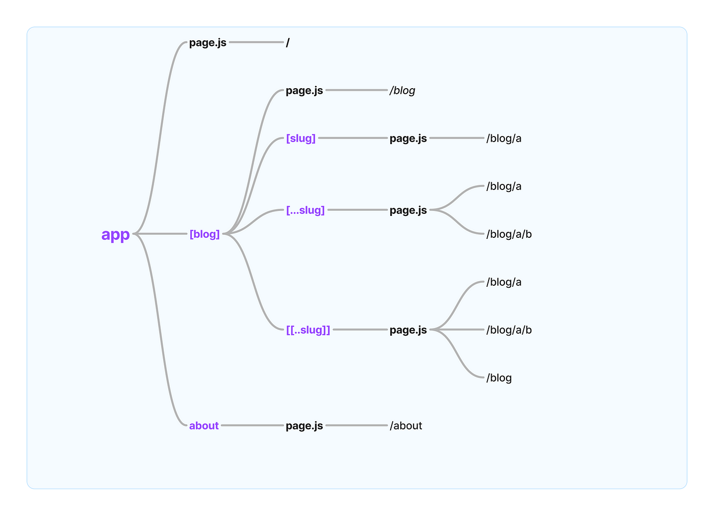

# **Next JS**

## **Table of Content**

* [**Introduction**](#introduction)
* [**Setting up development environment**](#setting-up-development-environment)
* [**Routing**](#routing)

## **Introduction**

* [**What is Next.js?**](#why-learn-next.js?)
* [**Prerequisites**](#prerequisites)
* [**Libraries vs Frameworks**](#libraries-vs-frameworks)
* [**Example Projects Built with React and Next.js**](#example-projects-built-with-react-and-next.js)
* [**Why Learn Next.js?**](#why-learn-next.js?)
* [**React Understanding**](#react-understanding)
* [**Before We Start**](#before-we-start)
* [**Why Next.js over Traditional React**](#why-next.js-over-traditional-react)
* [**SSR + SSG + ISR + RSC Quick Reference**](#ssr-+-ssg-+-isr-+-rsc-quick-reference)
* [**App Router vs Pages Router**](#app-router-vs-pages-router)

### **What is Next.js?**

**Next.js** is a powerful React framework used to build **full-stack, production-ready web applications**. While React itself is a library focused solely on building user interfaces, it lacks the structure and features required for creating complete applications.

Next.js builds on top of React, providing a robust framework that includes:

* File-based routing
* Optimized rendering (server-side and client-side)
* Integrated API routes
* Bundling and compiling
* Performance optimizations

These features come built-in, so there’s no need to manually install or configure third-party libraries for most use cases. Next.js follows certain conventions and opinions, but they are based on real-world experience building production applications and make development more efficient and scalable.

---

### **Prerequisites**

Before starting with Next.js, you should be familiar with:

* **HTML and CSS**
* **Modern JavaScript** (ES6+)
* **React fundamentals**, including:

  * Functional components
  * Props and state
  * JSX
  * React Hooks

---

### **Libraries vs Frameworks**

| Aspect                   | Library                                                               | Framework                                                                                                  |
| ------------------------ | --------------------------------------------------------------------- | ---------------------------------------------------------------------------------------------------------- |
| **Definition**           | A collection of reusable functions or tools you can call when needed. | A complete structure that provides a foundation and flow for your application.                             |
| **Control**              | **You** control the flow of the application.                          | The **framework** controls the flow; you fill in the blanks.                                               |
| **Inversion of Control** | **No** inversion of control – you call the library.                   | **Yes** – the framework calls your code (known as "Hollywood Principle": *Don’t call us, we’ll call you*). |
| **Flexibility**          | More flexible, you pick and choose when/how to use it.                | Less flexible; you're expected to follow framework conventions.                                            |
| **Examples**             | Lodash, Axios, React (often considered a library), jQuery             | Angular, Next.js, Django, Ruby on Rails                                                                    |

---

### **Example Projects Built with React and Next.js**

**React Projects**

| Project Name         | Description               | Key Features                                   |
| -------------------- | ------------------------- | ---------------------------------------------- |
| **To-Do List App**   | Basic task management     | CRUD, state management, component lifecycle    |
| **Weather App**      | Real-time weather fetch   | API calls, `useEffect`, conditional rendering  |
| **Calculator App**   | Basic calculator          | Event handling, state updates                  |
| **Chat App**         | Real-time messaging       | WebSocket/Firebase, state syncing              |
| **Movie Search App** | Search movie database     | API fetch, search, modals                      |
| **E-commerce UI**    | Product list, cart system | React Router, Context API, reusable components |

---

**Next.js Projects**

| Project Name              | Description                             | Key Features                                           |
| ------------------------- | --------------------------------------- | ------------------------------------------------------ |
| **Blog App**              | Markdown blog with SEO                  | App Router, SSG, dynamic routing, metadata             |
| **Portfolio Website**     | Personal site                           | Static generation, image optimization                  |
| **E-commerce Platform**   | Full shop with Stripe                   | SSR/ISR, API routes, client/server components          |
| **Admin Dashboard**       | Data dashboard for authenticated users  | Protected routes, server components, charts            |
| **Multi-language Site**   | Localized content                       | i18n, route-based language switching                   |
| **Auth App**              | Login, register, session-based access   | Middleware, next-auth, protected routing               |
| **CMS Blog**              | Blog using a headless CMS like Sanity   | ISR/SSG, API fetch, dynamic metadata                   |
| **Real-Time Chat App**    | Chat system with live updates           | API routes, WebSockets, real-time UI updates           |
| **Job Board**             | Job listings and filter                 | Dynamic routes, SSG/SSR, metadata                      |
| **SaaS Site + Dashboard** | Public landing + private user dashboard | App Router layouts, auth protection, role-based access |

---

### **Why Learn Next.js?**

Next.js greatly simplifies the process of building production-ready web applications. Some of the standout features include:

* [**File-Based Routing**](#file-based-routing)
* [**Built-In API Routes**](#built-in-api-routes)
* [**Rendering Flexibility**](#rendering-flexibility)
* [**Streamlined Data Fetching**](#streamlined-data-fetching)
* [**Performance Optimizations**](#performance-optimizations)
* [**Optimized Build System**](#optimized-build-system)

---

#### **File-Based Routing**

Instead of configuring a routing library manually (as in traditional React apps), you simply create files in the `app` or `pages` directory, and routes are generated automatically.



---

#### **Built-In API Routes**

Next.js allows you to build both frontend React components and backend APIs in the same codebase. This tight integration streamlines development and simplifies full-stack applications.

---

#### **Rendering Flexibility**

Next.js supports multiple rendering methods:

* Server-Side Rendering (SSR)
* Static Site Generation (SSG)
* Client-Side Rendering (CSR)

This flexibility allows for better performance and SEO (Search Engine Optimization).

---

#### **Streamlined Data Fetching**

With built-in support for asynchronous data fetching in React components, fetching data becomes more intuitive and efficient.

---

#### **Styling Options**

Next.js supports various styling methods:

* CSS Modules
* Tailwind CSS
* CSS-in-JS solutions

---

#### **Performance Optimizations**

Next.js includes automatic optimizations for:

* Images
* Fonts
* Scripts

These help improve **Core Web Vitals** and enhance the overall user experience.

---

#### **Optimized Build System**

Next.js offers a seamless development experience and an efficient production build pipeline—allowing you to focus on building features rather than dealing with configurations.

---

### **React Understanding**

Next.js is built on top of React, so a solid understanding of React is essential. Here are some key concepts to grasp:

* **Components**: The building blocks of React applications. Components can be functional or class-based.

* **Props**: Short for "properties," props are used to pass data from parent to child components.

* **State**: A built-in object that allows components to manage their own data. State changes trigger re-renders.

* **Lifecycle Methods**: Special methods that allow you to run code at specific points in a component's lifecycle (e.g., `componentDidMount`, `componentWillUnmount`).

* **Hooks**: Functions that let you use state and other React features in functional components. Common hooks include `useState`, `useEffect`, and `useContext`.

* **Context API**: A way to manage global state in React applications. It allows you to share data between components without passing props down manually.

* **React Router**: A library for handling routing in React applications. It allows you to create single-page applications with multiple views.

* **Redux**: A state management library often used with React. It provides a centralized store for managing application state.

* **React Query**: A library for managing server state in React applications. It simplifies data fetching, caching, and synchronization.

* **Styled Components**: A library for writing CSS in JavaScript. It allows you to style components using tagged template literals.

* **CSS Modules**: A CSS file in which all class names and animation names are scoped locally by default. This helps avoid naming conflicts.

* **Tailwind CSS**: A utility-first CSS framework that allows you to build custom designs without leaving your HTML.

* **TypeScript**: A superset of JavaScript that adds static typing. It helps catch errors at compile time and improves code quality.

* **ESLint**: A static code analysis tool for identifying problematic patterns in JavaScript code. It helps maintain code quality and consistency.

* **Prettier**: An opinionated code formatter that enforces a consistent style across your codebase. It helps improve readability and maintainability.

* **Jest**: A JavaScript testing framework used for unit and integration testing. It provides a simple API for writing tests and includes features like mocking and code coverage.

* **React Testing Library**: A library for testing React components. It provides utilities for rendering components and simulating user interactions.

* **Playwright**: A library for end-to-end testing of web applications. It allows you to automate browser interactions and test user flows.

* **Vercel**: The company behind Next.js. Vercel provides a platform for deploying Next.js applications with features like serverless functions, automatic scaling, and global CDN.

* **Render**: A cloud platform for deploying web applications. It provides a simple interface for deploying Next.js applications and includes features like automatic scaling and monitoring.

* **Docker**: A platform for building, shipping, and running applications in containers. It allows you to package your application and its dependencies into a single unit that can run anywhere.

* **Prisma**: An ORM (Object-Relational Mapping) tool for Node.js and TypeScript. It simplifies database access and provides a type-safe API for querying databases.

* **MongoDB**: A NoSQL database that stores data in flexible, JSON-like documents. It is often used with Node.js and Next.js applications.

* **PostgreSQL**: An open-source relational database management system. It is often used for larger applications and provides advanced features like transactions and indexing.

* **REST**: A set of architectural principles for designing networked applications. It uses standard HTTP methods (GET, POST, PUT, DELETE) to interact with resources.

* **WebSockets**: A protocol for full-duplex communication channels over a single TCP connection. It is often used for real-time applications like chat and notifications.

* **WebRTC**: A protocol for peer-to-peer communication in web applications. It allows you to build real-time applications like video conferencing and file sharing.

* **Service Workers**: A script that runs in the background of a web application. It allows you to intercept network requests and cache responses, enabling offline functionality and improved performance.

* **Progressive Web Apps (PWAs)**: A type of web application that uses modern web capabilities to deliver an app-like experience. PWAs can work offline, send push notifications, and be installed on the user's device.

* **Single Page Applications (SPAs)**: A type of web application that loads a single HTML page and dynamically updates the content as the user interacts with the app. SPAs provide a smoother user experience but can be more complex to build and optimize.

* **Multi-Page Applications (MPAs)**: A type of web application that consists of multiple HTML pages. Each page is loaded separately, and navigation between pages requires a full page reload. MPAs are simpler to build but can be less performant than SPAs.

* **React Suspense**: A feature that allows you to "suspend" rendering while waiting for data to load. This can improve the user experience by showing a loading state instead of a blank screen.

* **React.lazy()**: A function that allows you to load components lazily. This can improve performance by splitting your code into smaller chunks that are loaded only when needed.

* **React.memo()**: A higher-order component that memoizes a component's output. This can improve performance by preventing unnecessary re-renders.

* **React DevTools**: A browser extension for debugging React applications. It provides a visual interface for inspecting components, props, and state.

* **Zod**: A TypeScript-first schema declaration and validation library. It is often used for validating data structures and API responses.

* **Fetch API**: A built-in JavaScript API for making network requests. It is often used for fetching data in React applications.

* **GraphQL**: A query language for APIs. It allows you to request only the data you need and provides a flexible way to interact with APIs.

* **Apollo Client**: A library for managing GraphQL data in React applications. It simplifies data fetching, caching, and synchronization.

---

### **Before We Start**

Before diving into routing in Next.js, it's important to understand a core concept introduced in modern React and adopted by Next.js: **React Server Components (RSC)**.

* [**What Are React Server Components?**](#what-are-react-server-components?)
* [**Server vs Client Components**](#server-vs-client-components)
* [**When to Use Each**](#when-to-use-each)
* [**Why This Matters for Routing**](#why-this-matters-for-routing)

---

#### **What Are React Server Components?**

React Server Components represent a new architecture developed by the React team that introduces a more powerful and efficient way to build applications by dividing components into two categories:

* **Server Components**
* **Client Components**

This model is fully supported in **Next.js 13+**, and is a default behavior in **Next.js 15+**.

---

#### **Server vs Client Components**

* [**Server Components**](#server-components)
* [**Client Components**](#client-components)

##### **Server Components**

* Executed **on the server**.
* Can perform server-side operations such as:

  * Reading from the file system
  * Fetching data directly from databases

* **Cannot** use React hooks (e.g., `useState`, `useEffect`) or handle browser events (e.g., `onClick`).
* Ideal for performance, SEO, and resource-heavy tasks that don’t require user interaction.

##### **Client Components**

* Executed **in the browser**.
* Enable full interactivity:

  * Can use **React hooks**
  * Can handle **user interactions**
* Must begin with a special directive at the top of the file:

  ```tsx
  'use client';
  ```
* These behave just like traditional React components.

---

#### **When to Use Each**

* Use **Server Components** by default whenever possible for performance and simplicity.
* Use **Client Components** when you need:

  * Hooks like `useState`, `useEffect`, `useRouter`, etc.
  * DOM events and interactions (clicks, forms, etc.)
  * Dynamic rendering on the client side

---

#### **Why This Matters for Routing**

Understanding the distinction between server and client components is critical before learning how **routing** works in Next.js. Many routing features (like transitions, navigation hooks, or loading indicators) rely on using client components effectively.

---

### **Why Next.js over Traditional React**

When comparing Next.js to traditional React applications (created with Create React App or Vite), there are several key differences that make Next.js a more powerful choice for building modern web applications.

| Feature | React (CRA/Vite) | Next.js 15 (App Router) |
| --- | --- | --- |
| Routing | Manual (React Router) | Filesystem-based, automatic |
| Server-side rendering | ❌ | ✅ Built-in with `fetch()` |
| Metadata / SEO | Manual | Automatic via `metadata` export |
| Static + Dynamic Pages | Custom logic | Built-in (`revalidate`, `cache`) |
| Server components | ❌ | ✅ `app/` supports RSC out-of-box |

---

### **SSR + SSG + ISR + RSC Quick Reference**

**SSR (Server-Side Rendering)**: Fetches data on each request, generating HTML on the server. This is useful for dynamic content that changes frequently.

**SSG (Static Site Generation)**: Pre-renders pages at build time, generating static HTML. This is ideal for content that doesn't change often.

**ISR (Incremental Static Regeneration)**: Combines the benefits of SSR and SSG. It allows you to update static pages after the build process, making it suitable for content that changes occasionally.

**RSC (React Server Components)**: A new way to build components that run on the server. This allows for better performance and reduced client-side JavaScript.

**Key features of each rendering method:**

| Feature | How you write it | Result |
| --- | --- | --- |
| SSR | `await fetch(...)` with `cache: 'no-store'` | Runs on every request |
| SSG | `await fetch(...)` with `cache: 'force-cache'` | Static HTML |
| ISR | `await fetch(...)` with `next: { revalidate: 60 }` | Rebuilds after 60s |
| RSC | Default when no `use client` | Server-rendered with streaming |

---

### **App Router vs Pages Router**

Next.js has two different routers: the App Router and the Pages Router. 

The App Router is a newer router that allows you to use React's latest features, such as Server Components and Streaming. The Pages Router is the original Next.js router, which allowed you to build server-rendered React applications and continues to be supported for older Next.js applications.

---

## **Setting up development environment**

* [**Installing Node.js and npm**](#installing-node.js-and-npm)
* [**Next.js Blog Post Application Requirements**](#next.js-blog-post-application-requirements)
* [**Creating a new Next.js 15 app with App Router**](#creating-a-new-next.js-15-app-with-app-router)
* [**Project Structure**](#project-structure)
* [**Application Router vs Pages Router**](#application-router-vs-pages-router)

### **Installing Node.js and npm**

> **Node.js** includes **npm** (Node Package Manager), which you’ll use to install dependencies like Next.js.

* [**1. Windows Setup**](#1.-windows-setup)
* [**2. macOS Setup**](#2.-macos-setup)
* [**3. Linux Setup**](#3.-linux-setup-ubuntu-debian-based)


---

#### **1. Windows Setup**

---

**Official Installer**

**1.** Visit the official Node.js website:  

- 👉 [https://nodejs.org](https://nodejs.org/) 
- Download the **LTS version** (recommended for most users).

**2.** Run the installer:

- Follow the prompts (use default settings).
- Installs both **Node.js** and **npm**.

**3.** **Verify installation** in Command Prompt or PowerShell:

```bash
node -v
npm -v
```

---

**Using nvm-windows (Node Version Manager for Windows)**

> ⚠️ This is different from the nvm used on Linux/macOS.

**1.** Go to:  

- 👉 [https://github.com/coreybutler/nvm-windows/releases](https://github.com/coreybutler/nvm-windows/releases)

**2.** Download and run `nvm-setup.exe`.

**3.** In Command Prompt or PowerShell:

```bash
nvm install lts
nvm use lts
```

---

#### **2. macOS Setup**

---

**Official Installer**

**1.** Visit [https://nodejs.org](https://nodejs.org/) and download the **macOS Installer (LTS)**.

**2.** Run the `.pkg` file and complete the installation.

**3.** **Verify installation**:

```bash
node -v
npm -v
```

---

**Using Homebrew + NVM**

> NVM lets you manage multiple Node.js versions.

**1.** **Install Homebrew** (if not already installed):

```bash
/bin/bash -c "$(curl -fsSL https://raw.githubusercontent.com/Homebrew/install/HEAD/install.sh)"
```

**2.** **Install nvm**:

```bash
brew install nvm
mkdir ~/.nvm
```

**3.** **Add to your shell config** (`~/.zshrc`, `~/.bash_profile`, or `~/.zprofile`):

```bash
export NVM_DIR="$HOME/.nvm"
[ -s "$HOMEBREW_PREFIX/opt/nvm/nvm.sh" ] && \. "$HOMEBREW_PREFIX/opt/nvm/nvm.sh"
```

**4.** **Apply changes**:

```bash
source ~/.zshrc  # or ~/.bash_profile, depending on your shell
```

**5.** **Install Node.js**:

```bash
nvm install --lts
nvm use --lts
nvm alias default node
```

**6.** **Verify installation**:

```bash
node -v
npm -v
```

---

#### **3. Linux Setup**

---

**Official NodeSource Installer**

**1.** Run the following (replace `18` with your desired version):

```bash
curl -fsSL https://deb.nodesource.com/setup_18.x | sudo -E bash -
sudo apt-get install -y nodejs
```

**2.** **Verify installation**:

```bash
node -v
npm -v
```

---

**Using NVM**

**1.** **Install NVM**:

```bash
curl -o- https://raw.githubusercontent.com/nvm-sh/nvm/v0.39.7/install.sh | bash
```

**2.** **Load NVM** (add to `~/.bashrc` or `~/.zshrc`):

```bash
export NVM_DIR="$HOME/.nvm"
[ -s "$NVM_DIR/nvm.sh" ] && \. "$NVM_DIR/nvm.sh"
```

**3.** **Apply changes**:

```bash
source ~/.bashrc  # or source ~/.zshrc
```

**4.** **Install Node.js**:

```bash
nvm install --lts
nvm use --lts
nvm alias default node
```

**5.** **Verify installation**:

```bash
node -v
npm -v
```

---

### **Next.js Blog Post Application Requirements** 

* [**Objective**](#objective)
* [**Functional Requirements**](#functional-requirements)
* [**Technical Requirements**](#technical-requirements)
* [**Data Models**](#data-models)
* [**Non-Functional Requirements**](#non-functional-requirements)
* [**Optional Enhancements**](#optional-enhancements)
* [**Tech Stack**](#tech-stack)

#### **Objective**

To develop a **basic blog post application** using **Next.js 15** that showcases all major features of the framework, including the **App Router**, **server components**, **client components**, **dynamic routing**, **API routes**, **authentication**, **SEO optimization**, **image optimization**, **static generation**, **server-side rendering**, and more. The app will serve as a learning and demo tool.

---

#### Functional Requirements

* [1. **Homepage**](#1.-homepage)
* [2. **Blog Post Page**](#2.-blog-post-page)
* [3. **Create/Edit Blog Post Page**](#3.-create/edit-blog-post-page)
* [4. **Authentication**](#4.-authentication)
* [5. **Comments Section**](#5.-comments-section)
* [6. **Admin Dashboard**](#6.-admin-dashboard)
* [7. **Search and Filtering**](#7.-search-and-filtering)
* [8. **Tag and Category Pages**](#8.-tag-and-category-pages)

##### 1. **Homepage**

* Lists latest blog posts with title, excerpt, author, date, and thumbnail.
* Uses `fetch()` from a server component.
* Paginated or infinite scrolling.

##### 2. **Blog Post Page**

* Dynamic route: `/blog/[slug]`
* Displays full blog content.
* Rendered statically (SSG) if possible or SSR otherwise.
* Includes metadata (title, og tags) using `generateMetadata`.

##### 3. **Create/Edit Blog Post Page**

* Protected via authentication (admin-only).
* Rich text editor (Markdown or WYSIWYG).
* Uses client component + API call to submit.
* Form validation with Zod or Yup.

##### 4. **Authentication**

* Uses `next-auth` (auth.js).
* GitHub, Google OAuth login.
* Session-based access control.
* Logged-in users can like posts, add comments.

##### 5. **Comments Section**

* Comment form (client component).
* Displays threaded comments (SSR or ISR).
* Likes or reactions on comments (optional).

##### 6. **Admin Dashboard**

* Route: `/admin`
* List, edit, delete blog posts.
* Add new categories/tags.
* Protected route using middleware and session checking.

##### 7. **Search and Filtering**

* Client-side filtering by tag/category.
* Full-text search using server-side route or client search.

##### 8. **Tag and Category Pages**

* Dynamic routes: `/tag/[tag]`, `/category/[category]`
* Lists all posts under a tag or category.
* Uses `generateStaticParams` and `generateMetadata`.

---

#### **Technical Requirements**

**Next.js Features to Demonstrate**

| Feature                               | Description                                |
| ------------------------------------- | ------------------------------------------ |
| App Router                            | Use `/app` directory for routing           |
| Server Components                     | Fetch blog data from server components     |
| Client Components                     | Rich text editor, search bar, comment form |
| Dynamic Routing                       | Blog posts, categories, tags               |
| `generateMetadata()`                  | Dynamic SEO on each page                   |
| API Routes (`app/api`)                | For CRUD operations on posts/comments      |
| Authentication (`next-auth`)          | Secure login, protected routes             |
| Layouts & Templates                   | Global layout, nested layouts              |
| Static Generation (SSG)               | For most blog and category pages           |
| Server-Side Rendering (SSR)           | For search and user-specific pages         |
| Image Optimization                    | Blog post thumbnails with `<Image>`        |
| Middleware                            | Session handling and route protection      |
| ISR (Incremental Static Regeneration) | Revalidate content after changes           |
| Error & Loading UI                    | `error.js`, `loading.js` per route         |
| Environment Variables                 | For secure API keys                        |
| SEO/OG Tags                           | Using dynamic metadata                     |
| Deployment                            | Vercel or Docker deployment                |

---

#### **Data Models**

* [**Blog Post**](#blog-post)
* [**Comment**](#comment)

##### **Blog Post**

```ts
{
  id: string;
  title: string;
  slug: string;
  content: string;
  thumbnailUrl: string;
  authorId: string;
  createdAt: Date;
  updatedAt: Date;
  tags: string[];
  category: string;
}
```

##### **Comment**

```ts
{
  id: string;
  postId: string;
  author: string;
  message: string;
  parentId?: string;
  createdAt: Date;
}
```

---

#### **Non-Functional Requirements**

* **Responsive Design**: Mobile-first using Tailwind CSS.
* **Accessibility**: Authentication and Authorization.
* **Performance**: Lazy loading images, server components.
* **Security**: Auth, sanitization of user input.
* **Code Quality**: TypeScript, ESLint, Prettier.
* **Testing**: Unit tests (Jest), E2E (Playwright or Cypress).

---

####  **Optional Enhancements**

* Dark Mode toggle.
* Markdown editor with preview.
* Author profiles and bios.
* RSS Feed and sitemap generation.
* Email notifications on comments.
* PWA support.

---

####  **Tech Stack**

* **Frontend**: Next.js 15 (App Router), TypeScript, Tailwind CSS
* **Backend**: Next.js API routes or external backend
* **Database**: SQLite, PostgreSQL, or MongoDB (via Prisma or Mongoose)
* **Auth**: `next-auth`
* **Deployment**: Vercel / Docker + Render / Railway

---

### **Creating a new Next.js 15 app with App Router**

* [**Step 1 Create a Work Space Folder**](#step-1-create-a-work-space-folder)
* [**Step 2 Create a New Next.js Project for Blog Post**](#step-2-create-a-new-next.js-project-for-blog-post)
* [**Step 3 Run the Development Server**](#step-3-run-the-development-server)
* [**Step 4 Make Your First Edit**](#step-4-make-your-first-edit)

#### **Step 1 Create a Work Space Folder**

Create a folder to store your project files:

```bash
mkdir workspace
cd workspace
```

Open the folder in your code editor. If you're using VS Code:

```bash
code .
```

---

#### **Step 2 Create a New Next.js Project for Blog Post**

Run the following command in your terminal to scaffold a new Next.js project:

```bash
npx create-next-app@latest
```

You will be prompted to answer some configuration questions. Use the following choices:

| Prompt                               | Choice               |
| ------------------------------------ | -------------------- |
| Project name                         | `blog-post-app`      |
| TypeScript                           | Yes                  |
| ESLint                               | Yes                  |
| Tailwind CSS                         | Yes                  |
| Source directory                     | Yes (`/src`)         |
| App Router                           | Yes (recommended)    |
| Customize import alias               | No (default setting) |
| Use Turbopack (experimental bundler) | No                   |

Once completed, a new folder called `blog-post-app` will be created with your Next.js project setup.

#### **Step 3 Run the Development Server**

Navigate into the project folder:

```bash
cd blog-post-app
```

Then, start the development server:

```bash
npm run dev
```

Open your browser and go to `http://localhost:3000` to see your new Next.js app in action.

You should see the default Next.js welcome page.

---

#### **Step 4 Make Your First Edit**

To test live editing, follow these steps:

1. In your editor, open:
   `src/app/page.tsx`

2. Locate the section that says:
   *"Get started by editing `src/app/page.tsx`"*

3. Replace the second list item text with:

```tsx
Hello World
```

4. Save the file. Your browser will automatically refresh, and you’ll see your changes reflected instantly.

Congratulations — your first Next.js application is up and running!

---

### **Project Structure**

After creating and running a basic Next.js application, it's important to understand the structure of the project. This section breaks down the key files and folders that power your app.

* [**Key Files**](#key-files)
* [**Key Folders**](#key-folders)
* [**How It All Works**](#how-it-all-works)

---

#### **Key Files**

* [**`package.json`**](#package.json)
* [**Configuration Files**](#configuration-files)
* [**Other Files**](#other-files)

##### **`package.json`**

* Manages **project dependencies** and **scripts**.
* Common dependencies include:

  * `next` (v15)
  * `react` and `react-dom` (v19)
  * Optionally: `typescript`, `@types/*`, `tailwindcss`, `postcss`, `eslint`

* Common scripts:

  * `dev` – Start development server
  * `build` – Build for production
  * `start` – Start the production server
  * `lint` – Run ESLint using built-in configuration

##### **Configuration Files**

* `next.config.js` – Next.js configuration
* `tsconfig.json` – TypeScript settings
* `eslint.config.js` – ESLint configuration
* `tailwind.config.js` & `postcss.config.js` – Tailwind CSS setup

##### **Other Files**

* `package-lock.json` – Locks dependency versions for consistent installs
* `.gitignore` – Files and folders to ignore in version control
* `README.md` – Project overview and instructions
* `next-env.d.ts` – TypeScript environment declarations for Next.js

---

#### **Key Folders**

* [**`.next/`**](#.next/)
* [**`node_modules/`**](#node_modules/)
* [**`public/`**](#public/)
* [**`src/`**](#src/)

##### **`.next/`**

* Generated automatically during development or build.
* Stores compiled output and other internal data.
* **Ignored by version control** – no need to interact with it.

##### **`node_modules/`**

* Contains all project dependencies.
* Created by `npm install` or during initial project setup.
* Also **ignored by version control**.

##### **`public/`**

* Stores **static assets** like images, SVGs, and favicon files.
* Files in this folder are served at the root path (`/`).

##### **`src/`**

This is where most of the application code lives.

**Inside `src/`:**

* **`app/`** – The entry point of the application using the **App Router** (available from Next.js 13+).

**Files inside `app/`:**

* `favicon.ico` – Browser tab icon.
* `global.css` – Global styles for the app.
* `layout.tsx` – Root layout file. Used to wrap pages with shared UI (like headers, footers, themes).
* `page.tsx` – The **home page** of your app (`/` route). This is what you initially see when visiting `http://localhost:3000`.

> The component in `page.tsx` is passed as a child to the layout defined in `layout.tsx`. This composition defines the full structure of your home page.

You might notice a font import in `layout.tsx` (such as a Google font). This may appear differently depending on the exact minor version of Next.js, but it doesn’t impact core learning.

---

#### **How It All Works**

When you run:

```bash
npm run dev
```

The development server starts and executes the following flow:

1. **`package.json`** provides the `dev` script.
2. The **root layout** (`layout.tsx`) is rendered.
3. For the root URL (`/`), Next.js looks for `page.tsx` inside the `app/` folder.
4. The component from `page.tsx` is rendered as a child inside `layout.tsx`.

This is how the base UI is constructed and served at `http://localhost:3000`.

---

### **Application Router vs Pages Router**

| Feature / File | **App Router (`app/`)** | **Pages Router (`pages/`)** |
| --- | --- | --- |
| 📁 **Routing Directory** | `src/app/` | `src/pages/` |
| 🌐 **Route Files** | `page.tsx`, `layout.tsx` | `index.tsx`, `about.tsx` |
| 🧱 **Layout System** | `layout.tsx` (nested layouts supported) | `_app.tsx` (global layout only) |
| 🗂️ **CSS Files** | `globals.css`, `page.module.css` (scoped with modules) | `globals.css`, `Home.module.css` |
| 📃 **Document Customization** | *Not required – handled internally* | `_document.tsx` |
| 🔁 **Shared Layout Logic** | `layout.tsx` per route level | `_app.tsx` for global layout |
| 🧪 **API Routes** | Not in `app/` (requires `/pages/api`) | `pages/api/` (e.g., `hello.ts`) |
| ⚙️ **Server Components** | Supported natively | ❌ Not supported |
| 🔁 **Routing Behavior** | File-based + nested segments + layouts | File-based only (flat) |
| ✨ **New Features** | Server/Client components, Streaming, Metadata, etc. | Legacy, stable |
| 🧩 **Custom Head Handling** | `metadata` export in each route | `<Head>` tag in `_app.tsx` or pages |
| 🛠️ **Recommended Use** | From Next.js 13+ with App Router enabled | Default in older Next.js versions |

---


## **Routing**

Routing is one of the core features of **Next.js**, and it follows a **file-based routing** system. This means your app’s URL structure is directly mapped from how you organize folders and files within the `app` directory.

* [**Key Routing Conventions in Next.js**](#key-routing-conventions-in-next.js)
* [**Simple Routing Examples**](#simple-routing-examples)
* [**Multiple Routes**](#multiple-routes)
* [**Nested Routes**](#nested-routes)
* [**Dynamic Routes**](#dynamic-routes)
* [**Nested Dynamic Routes**](#nested-dynamic-routes)
* [**Catch-all Segments**](#catch-all-segments)
* [**Not Found Page**](#not-found-page)
* [**File Colocation**](#file-colocation)
* [**Private Folders**](#private-folders)
* [**Route Groups**](#route-groups)

---

### **Key Routing Conventions in Next.js**

Next.js routing is based on a few important conventions:

1. **All routes must live inside the `app/` folder** (which itself lives inside `src/`).
2. **Each route must be defined in a file named `page.tsx`** (or `page.js` if not using TypeScript).
3. **Each folder represents a segment of the URL path.**

---

### **Simple Routing Examples**

We want a simple homepage available at: `http://localhost:3000/`.

**Steps:**

1. Inside the `src/` directory, create a new folder called `app/`.
2. Inside the `app/` folder, create a file named `page.tsx`.
3. Add the following code:

```tsx
export default function Home() {
  return <h1>Welcome Home</h1>;
}
```

4. Start the dev server:

```bash
npm run dev
```

Visit `http://localhost:3000/` in your browser—you'll see "Welcome Home" rendered.

> **Note**: Even though we deleted the original `layout.tsx`, Next.js will regenerate it behind the scenes as part of its default behavior. We'll cover layouts in detail later.

---

### **Multiple Routes**

We’ll now create two new routes(Multiple routes):

* `/about` → shows an About page
* `/profile` → shows a Profile page

**Steps:**

1. In the `app/` folder, create a new folder named `about/`.
2. Inside `about/`, create a file named `page.tsx` with:

```tsx
export default function About() {
  return <h1>About Me</h1>;
}
```

3. Similarly, create another folder inside `app/` called `profile/`.
4. Inside `profile/`, create `page.tsx` with:

```tsx
export default function Profile() {
  return <h1>My Profile</h1>;
}
```

5. Save the files and navigate to the URLs:

   * `http://localhost:3000/about` → displays "About Me"
   * `http://localhost:3000/profile` → displays "My Profile"

---

#### **Summary of Key Routing Concepts**

* `page.tsx` inside the `app/` folder maps to the root route `/`.

* Each folder in `app/` represents a **URL segment**.

* A `page.tsx` file inside a folder maps to that folder's **route path**.

  For example:

  ```
  src/
  └── app/
      ├── page.tsx              --> /
      ├── about/
      │   └── page.tsx          --> /about
      └── profile/
          └── page.tsx          --> /profile
  ```

* If a user navigates to a route that doesn’t exist (e.g., `/dashboard`), Next.js automatically returns a **404 Not Found** page.

---

### **Nested Routes**

Routing uses a **file-based routing system**, where folders and files under the `app/` directory determine the structure of your application’s URLs. Now, let’s explore **nested routing** by implementing a `blog` section with its own sub-routes.

* [**Create a Blog Route with Nested Pages**](#create-a-blog-route-with-nested-pages)
* [**Creating Nested Routes**](#creating-nested-routes)
* [**Route Structure Summary**](#route-structure-summary)

---

#### **Create a Blog Route with Nested Pages**

We want to implement the following routes:

* `/blog` – Main blog landing page
* `/blog/first` – First blog post
* `/blog/second` – Second blog post

**Steps:**

1. Inside the `app/` directory, create a folder named `blog/`.
2. Inside `blog/`, create a `page.tsx` file:

```tsx
export default function Blog() {
  return <h1>My Blog</h1>;
}
```

3. This will render at `http://localhost:3000/blog`.

---

#### **Creating Nested Routes**

To handle `/blog/first` and `/blog/second`, follow these steps:

1. Inside the `blog/` folder, create two subfolders: `first/` and `second/`.
2. In each of those folders, create a `page.tsx` file:

**`app/blog/first/page.tsx`**

```tsx
export default function FirstBlogPost() {
  return <h1>First Blog Post</h1>;
}
```

`app/blog/second/page.tsx`

```tsx
export default function SecondBlogPost() {
  return <h1>Second Blog Post</h1>;
}
```

3. Now the following routes are available:

   * `http://localhost:3000/blog/first` → shows *First Blog Post*
   * `http://localhost:3000/blog/second` → shows *Second Blog Post*

---

#### **Route Structure Summary**

Your folder and file structure now looks like this:

```
src/
└── app/
    └── blog/
        ├── page.tsx           → /blog
        ├── first/
        │   └── page.tsx       → /blog/first
        └── second/
            └── page.tsx       → /blog/second
```

**Key Takeaway**

Next.js automatically mirrors your folder structure into URL routes. You don’t need to write route configuration files or install any extra libraries—**just follow the folder and file naming conventions**, and routing will work out of the box.

---

### **Dynamic Routes**

Previous example, we've seen how **nested routing** works by creating folders like `/blog/first` and `/blog/second`. However, this approach doesn't scale well for large datasets or content fetched dynamically. That’s where **dynamic routes** come in.

* [**Blog Listing Dynamic Route**](#blog-listing-dynamic-route)
* [**Step 1 Create the Static Post List**](#step-1-create-the-static-post-list)
* [**Step 2 Set Up the Dynamic Route**](#step-2-set-up-the-dynamic-route)
* [**Dynamic Segments**](#dynamic-segments)
* [**Dynamic Routing Structure Summary**](#dynamic-routing-structure-summary)

#### **Blog Listing Dynamic Route**

* `/blog/posts/[postId]` – Dynamic route for blog posts.
* `[postId]` is a **dynamic segment** that can match any blog post ID.

---

#### **Step 1 Create the Static Post List**

1. Inside the `app/blog/` directory, create a `posts/` folder.
2. Inside `posts/`, create a `page.tsx` file:

```tsx
export default function PostList() {
  return (
    <div>
      <h1>Blog Post List</h1>
      <h2>Post 1</h2>
      <h2>Post 2</h2>
      <h2>Post 3</h2>
    </div>
  );
}
```

* This page will render at `http://localhost:3000/blog/posts`.

---

#### **Step 2 Set Up the Dynamic Route**

Manually creating a folder for every blog ID (like `/blog/posts/1`, `/blog/posts/2`, etc.) isn’t scalable. Instead, we use **dynamic segments**.

1. Inside the `blog/posts/` folder, create a new folder named `[blogId]/`.
2. Inside `[blogId]/`, create a `page.tsx` file:

```tsx
// app/blog/posts/[blogId]/page.tsx

type Params = {
  params: {
    productId: string;
  };
};

export default async function PostDetails({ params }: Params) {
  const { blogId } = params;

  return <h1>Details about Blog Post {blogId}</h1>;
}
```

* This file handles all routes like:

  * `/blog/posts/1`
  * `/blog/posts/2`

---

#### **Dynamic Segments**

* A folder name in square brackets like `[blogId]` tells Next.js to treat it as a **dynamic route parameter**.
* The `params` object contains all route parameters and is **available to server components** as a prop.

---

#### **Dynamic Routing Structure Summary**

Here’s what your folder structure looks like now:

```
src/
└── app/
    └── blog/
        ├── page.tsx
        ├── posts/
        │   ├── page.tsx        → /blog/posts
        │   └── [blogId]/
        │       └── page.tsx    → /blog/posts/[blogId]
```

Now any route that matches '/`blog/posts/[blogId]` will be handled by the `page.tsx` file inside the `[blogId]` folder.

**Example Output**

* Visiting `http://localhost:3000/blog/posts/1` will show: **Details about Blog Post 1**
* Visiting `http://localhost:3000/blog/posts/2` will show: **Details about Blog Post 2**

---

### **Nested Dynamic Routes**

In many real-world applications, you'll often need to handle **multiple dynamic segments** in a single URL. That’s where **nested dynamic routing** becomes incredibly useful.

* [**Post Comments Dynamic Route**](#post-comments-dynamic-route)
* [**Step-by-Step Setup**](#step-by-step-setup)
* [**Nested Dynamic Routing Structure Summary**](#nested-dynamic-routing-structure-summary)

---

#### **Post Comments Dynamic Route**

We’ve already implemented dynamic post detail pages at:

* `/blog/posts/[postId]` – Displays details about a specific blog post.

Now, we want to add a **nested dynamic route** for comments:

* `/blog/posts/[postId]/comments/[commentId]` – Displays details about a specific comment on a blog post.
* `[postId]` and `[commentId]` are both dynamic segments.

---

#### **Step-by-Step Setup**

* [**Step 1 Start from Existing Dynamic Route**](#step-1-start-from-existing-dynamic-route)
* [**Step 2 Add `comments/` Folder**](#step-2-add-comments/-folder)
* [**Step 3 Add Dynamic `[commentId]/` Folder**](#step-3-add-dynamic-[commentId]/-folder)

---

##### **Step 1 Start from Existing Dynamic Route**

We already have this structure:

```
src/
└── app/
    └── blog/
        ├── page.tsx
        ├── posts/
        │   ├── page.tsx        → /blog/posts
        │   └── [postId]/
        │       └── page.tsx    → /blog/posts/[postId]
```

---

##### **Step 2 Add `comments/` Folder**

1. Inside the `posts/[postId]/` folder, create a new folder named `comments/`.

2. Inside `comments/`, create a `page.tsx` file:

```tsx
export default function Comments() {
  return <h1>Comments Section</h1>;
}
```

3. This will render at `http://localhost:3000/blog/posts/[postId]/comments`.

4. Save the file and navigate to `http://localhost:3000/blog/posts/1/comments` in your browser. You should see "Comments Section" displayed.

5. Now, we want to add a dynamic route for individual comments.

---

##### **Step 3 Add Dynamic `[commentId]/` Folder**

1. Inside the `comments/` folder, create a new folder named `[commentId]/`.

2. Inside `[commentId]/`, create a `page.tsx` file:

```tsx
// app/blog/posts/[postId]/comments/[commentId]/page.tsx

type Params = {
  params: {
    postId: string;
    commentId: string;
  };
};

export default function CommentDetails({ params }: Params) {
  const { postId, commentId } = params;

  return <h1>Details about Comment {commentId} on Post {postId}</h1>;
}
```

3. This file will handle all routes like:

   * `/blog/posts/1/comments/1`
   * `/blog/posts/1/comments/2`
   * `/blog/posts/2/comments/1`

4. Save the file and navigate to `http://localhost:3000/blog/posts/1/comments/1` in your browser. You should see "Details about Comment 1 on Post 1" displayed.

---

#### **Nested Dynamic Routing Structure Summary**

Here’s what your folder structure looks like now:

```
src/
└── app/
    └── blog/
        ├── page.tsx
        └── posts/
            ├── page.tsx                → /blog/posts
            └── [postId]/
                ├── page.tsx            → /blog/posts/[postId]
                └── comments/
                    ├── page.tsx        → /blog/posts/[postId]/comments
                    └── [commentId]/
                        └── page.tsx    → /blog/posts/[postId]/comments/:[commentId]
```

**Key Takeaway**

You can create nested dynamic routes easily using folders with square brackets:

* `[postId]` for dynamic segments
* `[commentId]` for nested dynamic segments
* This allows you to create complex URL structures without writing any additional routing logic.

---

### **Catch-all Segments**

Catch-all segments in Next.js allow you to handle dynamic routes with multiple path segments using just a **single file**. This is especially powerful for documentation sites, wikis, and other apps that require deeply nested or flexible routing structures.

* [**Documentation Site with Nested Routes**](#documentation-site-with-nested-routes)
* [**Use a Catch-all Route**](#use-a-catch-all-route)
* [**Optional Catch-all Segments**](#optional-catch-all-segments)
* [**Catch-all Segments Structure Summary**](#catch-all-segments-structure-summary)

---

#### **Documentation Site with Nested Routes**

Imagine building a documentation site where each feature contains several concepts, and each concept might have further nested examples. Example routes:

```
/docs/feature1/concept1  
/docs/feature1/concept2  
/docs/feature2/concept1/example1  
...
```

Now, if you had 20 features and each had 20 concepts, you'd be looking at **400+ different routes**. File-based routing would make this hard to scale—unless we use **dynamic** and **catch-all segments**.

---

#### **Use a Catch-all Route**

We can simplify this setup to just **one** route handler using a catch-all segment.

* [**Step 1 Create the Catch-all Folder**](#step-1-create-the-catch-all-folder)
* [**Step 2 Implement the Component**](#step-2-implement-the-component)

##### **Step 1 Create the Catch-all Folder**

In your `app` directory, create the following structure:

```
app/
└── docs/
    └── [...slug]/
        └── page.tsx
```

* The folder `[...slug]` uses the `...` syntax (like the JavaScript spread operator), which means: “match **any number of path segments**.”
* Inside `[...slug]`, create a `page.tsx` file.

---

##### **Step 2 Implement the Component**

Here’s a simple example of how to access and display the segments:

```tsx
// app/docs/[...slug]/page.tsx

type Params = {
  params: {
    slug?: string[];
  };
};

export default async function DocsPage({ params }: Params) {
  const slug = params.slug ?? [];

  if (slug.length === 2) {
    return <h1>Viewing docs for feature "{slug[0]}" and concept "{slug[1]}"</h1>;
  }

  if (slug.length === 1) {
    return <h1>Viewing docs for feature "{slug[0]}"</h1>;
  }

  return <h1>Docs homepage</h1>;
}
```

Now try visiting these routes:

* `/docs/routing` → Viewing docs for feature **routing**

* `/docs/routing/catch-all-segments` → Viewing docs for feature **routing** and concept **catch-all-segments**

* `/docs` → You’ll see a **404** error (but we’ll fix that next!)

---

#### **Optional Catch-all Segments**

To handle even `/docs` using the same file, make the segment **optional** by renaming the folder to:

```
[[...slug]]
```

So now the structure becomes:

```
app/
└── docs/
    └── [[...slug]]/
        └── page.tsx
```

Now, `/docs` will also be matched and render the same page component.

**Use Cases**

Use **optional catch-all segments** when:

* You want a single page to handle multiple levels of routes.
* The layout or logic of the page depends on the depth or content of the route.

---

#### **Catch-all Segments Structure Summary**

```
app/
├── page.tsx                  → /
└── docs/
    └── [[...slug]]/
        └── page.tsx          → /docs/* (all depths)
```

* **Catch-all segments** (`[...slug]`) match any number of nested route segments.
* **Optional catch-all segments** (`[[...slug]]`) also match when no segments are present.
* Use `params.slug` to access the segments in your component.
* Ideal for documentation sites, blogs, and pages with variable depth.

---

### **Not Found Page**

Next.js makes it simple to define a **custom 404 page** using the App Router. This allows you to provide a more branded and user-friendly experience when users navigate to a route that doesn’t exist.

By default, visiting an unknown route (e.g. `http://localhost:3000/building`) will display a generic Next.js 404 page, which is fine for development but insufficient for production environments.

* [**Step 1 Create a Global Not Found Page**](#step-1-create-a-global-not-found-page)
* [**Triggering Not Found Programmatically**](#triggering-not-found-programmatically)
* [**Route-Specific Not Found**](#route-specific-not-found)

---

#### **Step 1 Create a Global Not Found Page**

Create a `not-found.tsx` file in the `app/` directory:

```
app/
├── not-found.tsx
```

```tsx
// app/not-found.tsx

export default function NotFound() {
  return (
    <div>
      <h2>Page Not Found</h2>
      <p>Could not find the requested resource.</p>
    </div>
  );
}
```

This file will **automatically** be used by Next.js for all unmatched routes.

---

#### **Triggering Not Found Programmatically**

Sometimes you want to manually show a 404 page from within a page. For example, if your post comment system should not show comments above ID 1000, use the `notFound()` function:

```tsx
// app/blog/posts/[postId]/comments/[commentId]/page.tsx
import { notFound } from 'next/navigation';

export default function PostCommnet({ params }: { params: { commentId: string } }) {
  const commentId = parseInt(params.commentId);

  if (commentId > 1000) {
    notFound();
  }

  return <h1>Comment ID: {commentId}</h1>;
}
```

---

#### **Route-Specific Not Found**

You can also create **section-specific** not-found pages by adding `not-found.tsx` within route folders. Next.js will use the **closest** matching `not-found.tsx`.

For example:

```
src/
└── app/
    ├── not-found.tsx
    └── blog/
        ├── not-found.tsx
        └── posts/
            └── [postId]/
                └── comments/
                    └── [commentId]/
                        └── not-found.tsx
```

```tsx
// app/blog/posts/[postId]/comments/[commentId]/not-found.tsx

'use client';

import { usePathname } from 'next/navigation';

export default function NotFound() {
  const pathname = usePathname();
  const segments = pathname.split('/');

  const postId = segments[2];
  const commentId = segments[4];

    return (
        <div>
        <h2>Comment Not Found</h2>
        <p>Could not find comment {commentId} for post {postId}.</p>
        </div>
    );
}
```

> **Note:** Since you're using the `usePathname()` hook, mark this file as a **client component** with `'use client'`.

---

### **File Colocation**

While Next.js follows a **file-system based routing** convention, it’s also **flexible** about how you organize your files and folders. This concept is known as **file colocation**, and it plays a key role in keeping your project maintainable and scalable.

* [**Understanding File Colocation**](#understanding-file-colocation)
* [**Organizing Your Project**](#organizing-your-project)

---

#### **Understanding File Colocation**

Each folder in the `app/` directory represents a **route segment** that maps directly to a URL path. But **a route only becomes accessible if a `page.tsx` file exists within that folder**.

* [**Example Creating a Route**](#example-creating-a-route)
* [**Making the Route Public**](#making-the-route-public)

---

##### **Example Creating a Route**

Suppose we create a folder and a component like this:

```
app/
└── dashboard/
    └── LineChart.tsx
```

```tsx
// app/dashboard/LineChart.tsx

export default function LineChart() {
  return <h1>Line Chart</h1>;
}
```

Now, if you visit `/dashboard` in the browser, you’ll get a **404 error**.

Why? Because there's **no `page.tsx`** in the `dashboard` folder yet.

---

##### **Making the Route Public**

Now add a `page.tsx` file:

```tsx
// app/dashboard/page.tsx

export default function Dashboard() {
  return <h1>Dashboard</h1>;
}
```

Now `/dashboard` will render correctly in the browser, showing the "Dashboard" heading.


> * Only files named `page.tsx` (or `layout.tsx`, `loading.tsx`, etc.) are **treated as special** by the router.
>
> * Any other file (e.g. `BarChart.tsx`, `utils.ts`) **can be safely colocated** inside the same folder without making it a route.
> 
> * These files won't be publicly accessible or interfere with routing, unless explicitly used by a `page.tsx` or another component.

---

#### **Organizing Your Project**

Next.js allows flexibility in how you organize supporting files:

* You **can colocate** components, helpers, and modules inside the `app/` route folders for tight cohesion.
* Alternatively, you **can separate** UI components into a dedicated `components/` or `src/` folder outside of `app/`, which is a common pattern in many large-scale projects.

> Example: The `shadcn/ui` library follows the separate `components/` structure for clean separation of concerns.

---

### **Private Folders**

As we just explored file collocation, let’s now dive into a **Next.js-exclusive organizational feature** called **private folders**. This pattern helps keep your project clean and focused by **excluding internal folders from routing**.

* [**What is a Private Folder?**](#what-is-a-private-folder?)
* [**Example Creating a Private Folder**](#example-creating-a-private-folder)
* [**Why Use Private Folders?**](#why-use-private-folders?)

---

#### **What is a Private Folder?**

A **private folder** in Next.js is any folder **prefixed with an underscore (`_`)**. These folders and their contents are **ignored by the routing system**.

> Useful for keeping internal utilities, helpers, or non-UI logic separate from your app’s public routing structure.

---

#### **Example Creating a Private Folder**

Let’s walk through it.

```
app/
└── _lib/
    ├── formatDate.ts
    └── page.tsx ← This won't be routable
```

```tsx
// app/_lib/page.tsx

export default function PrivateRoute() {
  return <h1>You cannot view this in the browser</h1>;
}
```

If you now navigate to `/lib` in the browser, you’ll get a **404 error** – because `_lib` is a private folder.

Even though it contains a valid `page.tsx` file, **Next.js excludes it from route generation**.

---

#### **Why Use Private Folders?**

Private folders are a great way to:

* **Keep routing logic clean** by isolating internal logic.
* **Avoid naming conflicts** with future Next.js reserved filenames.
* **Group utilities and internal components** for easier navigation in editors.
* **Maintain a consistent project structure** for teams and large projects.

---

### **Route Groups**

**Route Groups** are a powerful way to **organize your project’s routing structure without affecting the URL paths**. They help teams manage complex apps while keeping URLs clean and intuitive.

* [**What Are Route Groups?**](#what-are-route-groups?)
* [**Scenario Organizing Auth Routes**](#scenario-organizing-auth-routes)
* [**Grouping Auth Routes**](#grouping-auth-routes)

---

#### **What Are Route Groups?**

* A **route group** is a folder wrapped in parentheses like `(group-name)` inside the `app/` directory.
* Files inside a route group behave **exactly the same** as regular routes.
* The **folder name is excluded from the URL**.

> Route groups are also the **only way to share layouts** between multiple routes **without changing the URL structure**.

---

#### **Scenario Organizing Auth Routes**

Let’s say we are building the following auth routes:

* `/register`
* `/login`
* `/forgot-password`

First, create individual folders for each:

```
app/
├── register/
│   └── page.tsx     → /register    
├── login/
│   └── page.tsx     → /login
└── forgot-password/
    └── page.tsx     → /forgot-password
```

Each `page.tsx`:

```tsx
// app/register/page.tsx
export default function Register() {
  return <h1>Register</h1>;
}
```

```tsx
// app/login/page.tsx
export default function Login() {
  return <h1>Login</h1>;
}
```

```tsx
// app/forgot-password/page.tsx
export default function ForgotPassword() {
  return <h1>ForgotPassword</h1>;
}
```

So far, everything works great — but the auth routes are scattered.

---

#### **Grouping Auth Routes**

To improve structure, let’s move these into a logical group:

```
app/
└── (auth)/
    ├── register/        
    │   └── page.tsx    → /register
    ├── login/
    │   └── page.tsx    → /login
    └── forgot-password/
        └── page.tsx    → /forgot-password
```

> Rename the folder as `(auth)` – **parentheses indicate a route group**.

**Resulting URLs:**

* `/register`
* `/login`
* `/forgot-password`

> URLs stay clean — just like before.
>
> Internally, code is now much better organized.

---